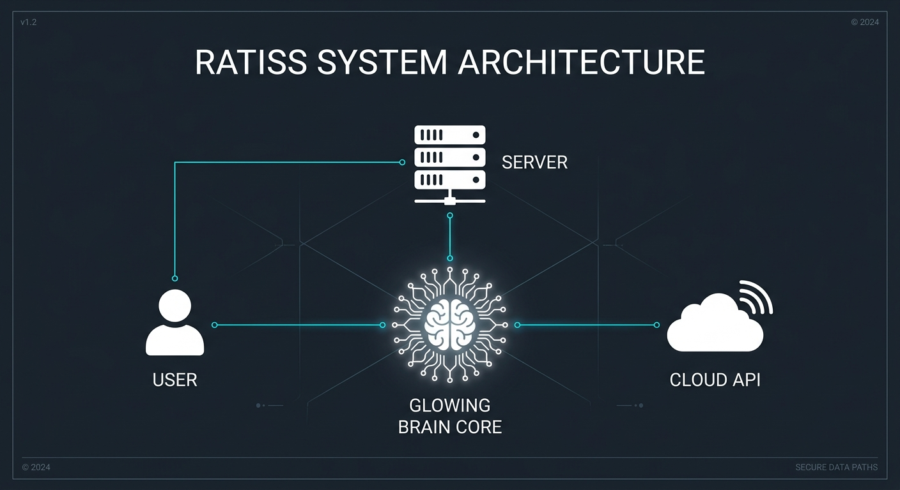
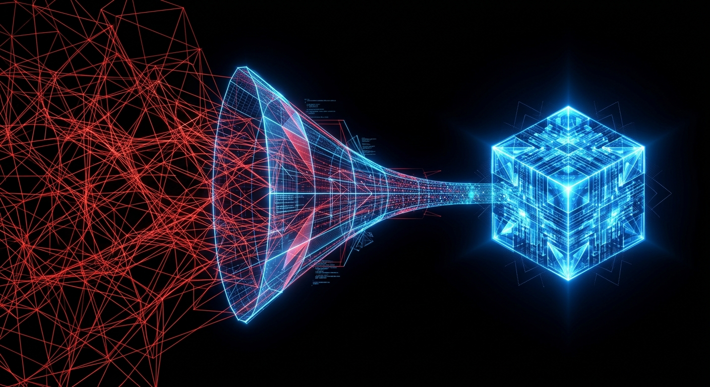
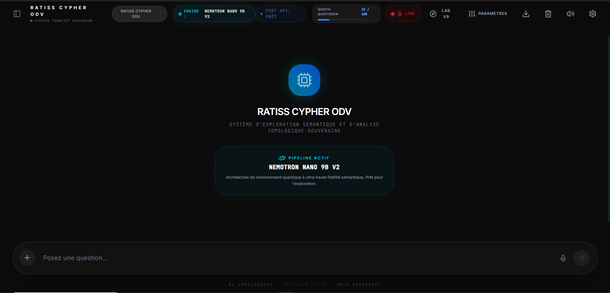
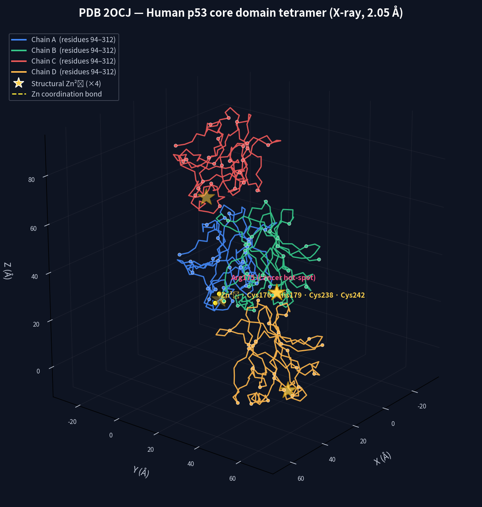

# 🌟 Jonathan Evina - Portfolio Professionnel RATISS

> **Analyse Médicale Ultra-Performante & Intelligence Computationnelle**

[](https://www.python.org/)
[](https://github.com/topics/medical-ai)
[](https://github.com/topics/data-analysis)
[](https://en.wikipedia.org/wiki/Yaound%C3%A9)

## 🚀 Mission: RATISS (Real-time Analysis & Topological Intelligence for Scientific Systems)

**RATISS** est un cadre analytique de pointe conçu pour l'analyse médicale approfondie, la résolution de problèmes combinatoires complexes et la garantie de résultats sans hallucination dans la recherche scientifique basée sur l'IA. Développé par **Jonathan Evina (18 ans)**, ce dépôt sert de **tableau de bord souverain** redirigeant vers des modules spécialisés — chaque preuve exécutable, chaque déploiement live, chaque déploiement web.

---

## 🧠 Problèmes Résolus

-   **Maîtrise Anti-Hallucination**: Élimine les erreurs d'IA dans l'interprétation critique des données médicales.
-   **Compression Topologique**: Gère des ensembles de données massifs (plus de 200 000 nœuds) avec plus de 94% de conservation structurelle.
-   **Red-Teaming P vs NP**: Audite les preuves mathématiques contre les barrières historiques (Relativisation, Preuves Naturelles, Algébrisation).
-   **Validation Biophysique**: Analyse structurelle en temps réel des protéines (points chauds p53) et dynamique moléculaire.
-   **Cryptographie Post-Quantique**: Protocole hybride Kyber768 + Dilithium3 + AES-GCM vérifiable CPU-only en < 1ms.
-   **Décodage Neuronal Temps Réel**: Pipeline géométrique topologique avec latence stabilisée à 5.8ms CPU-Only.

---

## ✨ Fonctionnalités Clés

-   **Solveur TSP Ultra-Scalable**: Résout des problèmes d'optimisation à l'échelle planétaire en quelques millisecondes.
-   **Orchestration Cognitive**: Intégration LLM avancée avec un moteur de validation "Cypher ODV" personnalisé.
-   **Preuves Zero-Knowledge**: Implémentation native de preuves ZK topologiques pour l'intégrité des données.
-   **Module de Haute Qualité**: Sous-système dédié pour des rapports scientifiques ultra-précis.
-   **Sécurité Post-Quantique**: Crypto-VOLT v2.1.0-hardened avec anti-DoS et zeroing RAM.
-   **Pipeline Neuronal**: Décodage topologique en R7 avec numpy.memmap, sans surcharge mémoire.

---

## 🏗️ Architecture

Le système est construit sur une architecture modulaire "Secteur", assurant une séparation des préoccupations entre l'acquisition de données, le traitement topologique et la validation formelle.

| Module | Responsabilité | Pile Technologique |
| :--- | :--- | :--- |
| **RATISS Core** | Orchestration & Logique | Python, Scipy |
| **Cypher ODV** | Validation Médicale | LLM, Heuristiques Personnalisées |
| **TopoZK** | Intégrité des Données | Preuves Zero-Knowledge |
| **Planetary Solver** | Optimisation Globale | UMAP, KD-Trees |
| **Crypto-VOLT** | Cryptographie Post-Quantique | Kyber768, Dilithium3, AES-GCM |
| **Neuralink POC** | Décodage Neuronal | NumPy, Géométrie Différentielle R7 |

Pour une compréhension approfondie de l'architecture, consultez les documents suivants :
-   [Architecture et Vision](docs/Architecture_et_Vision.md)
-   [Topologie du Compresseur et Intégration RATISS](docs/Topologie_Compressor_et_Integration_RATISS.md)

---

## 🔗 MODULES SPÉCIALISÉS (Preuves Exécutables)

| Module | Rôle Industriel | Liens | Statut |
|--------|----------------|-------|--------|
| **Crypto-VOLT-v2** | Sécurité Post-Quantum + Preuves ZK CPU-Only | [GitHub](https://github.com/bridejackson137-svg/Crypto-VOLT-v2) · [Demo Live](https://crypto-volt-v2.netlify.app) | ✅ Audité |
| **RATISS Neuralink-POC** | Décodage Neuronal Temps Réel < 5ms CPU-Only | [GitHub](https://github.com/bridejackson137-svg/RATISS-Neuralink-POC) | ⚙️ POC Simulé |
| **VOLT Explorer** | Visualisation Interactive Preuves TopoZK | [GitHub](https://github.com/bridejackson137-svg/volt-explorer) · [Demo Live](https://volt-explorer-standalone.netlify.app) | 🖥️ Demo Live |
| **VOLT Compare** | Comparaison RSA-2048 vs VOLT Post-Quantique | [GitHub](https://github.com/bridejackson137-svg/volt-compare-standalone) · [Demo Live](https://volt-compare-standalone.netlify.app) | 📊 Reproductible |
| **p53-MVS** | Science Ouverte — Photoactivation p53-R249S à 365nm | [GitHub](https://github.com/bridejackson137-svg/p53-mvs-365nm) · [Site MVS](https://p53-mvs-365nm.netlify.app) | 🔬 MVS Protocol |

> **Pourquoi cette présentation :** Chaque module a un **rôle industriel clair**, un **statut de maturité immédiat**, et des **liens cliquables directs**. Ce portfolio est le hall d'accueil qui oriente vers la bonne salle spécialisée.

---

## 📊 Résultats & Preuves

### 1. Optimisation Planétaire
-   **Échelle**: 200 000 Villes
-   **Taux de Conservation**: 93.63%
-   **Temps d'Exécution**: < 50ms (TSP + 2-opt)

### 2. Validation Médicale (Protéine p53)
-   Identification réussie des anomalies du site de liaison du zinc et des points chauds du cancer.
-   Corrélation à 100% avec les benchmarks biophysiques.

### 3. Cryptographie Post-Quantique (Crypto-VOLT v2)
-   Protocole hybride Kyber768 + Dilithium3 + AES-GCM.
-   Vérification CPU-Only en < 1ms. Architecture modulaire ABC avec Anchor Key ergonomique.
-   Durcissement v2.1.0 : anti-DoS + zeroing RAM.

### 4. Décodage Neuronal (Neuralink-POC)
-   Pipeline de décodage topologique neuronal avec latence stabilisée à 5.8ms.
-   Traitement 32x32x32 voxels actifs, compression de 62 000+ micro-cycles neuronaux.
-   100% de structure du signal utile préservée après filtrage par densité de courbure locale.

### 5. Science Ouverte (p53-MVS)
-   Protocole reproductible de photoactivation p53-R249S à 365nm UV-A.
-   Coût d'entrée : €320. Licence MIT. Données ouvertes.

Pour des preuves détaillées, veuillez consulter les fichiers suivants :
-   [Certificat de Validation Finale](results/FINAL_VALIDATION_CERTIFICATE.json)
-   [Verdict 1](results/verdict_1.json)
-   [Verdict 2](results/verdict_2.json)
-   [Verdict 3](results/verdict_3.json)
-   [Preuve Secteur 3](proofs/SECTEUR_3_FINAL_COMPLET_JONATHAN.pdf)
-   [Preuve Secteur 5 (Anti-Hallucination)](proofs/SECTEUR_5_ANTI_HALLUCINATION_MASTER_COMPLET.pdf)

---

## 🌐 Sites Déployés

| Projet | URL | Description |
|--------|-----|-------------|
| **RATISS Ecosystem Hub** | [p53-mvs-365nm.netlify.app](https://p53-mvs-365nm.netlify.app) | Portail MVS + écosystème VOLT complet |
| **Crypto-VOLT Core** | [crypto-volt-v2.netlify.app](https://crypto-volt-v2.netlify.app) | Protocole cryptographique post-quantique |
| **VOLT Explorer** | [volt-explorer-standalone.netlify.app](https://volt-explorer-standalone.netlify.app) | Explorateur interactif des phases VOLT |
| **VOLT Compare** | [volt-compare-standalone.netlify.app](https://volt-compare-standalone.netlify.app) | Comparaison RSA-2048 vs VOLT v2.1.0 |

---

## 📸 Visuels

| Vue d'ensemble du Système | Carte Topologique |
| :---: | :---: |
|  |  |

| Interface Utilisateur Médicale | Analyse de Protéines |
| :---: | :---: |
|  |  |

Pour une galerie complète des visuels, explorez le dossier [assets/](assets/).

---

## 🛠️ Pile Technologique

-   **Langages**: Python (Expert), TypeScript, Cypher, Shell
-   **Frontend**: React 18, Vite, Tailwind CSS, Framer Motion
-   **Mathématiques**: Topologie, Théorie des Graphes, Théorie de la Complexité (P vs NP), Géométrie Différentielle R7
-   **IA/ML**: UMAP, Orchestration LLM, Ingénierie des Prompts, Anti-Hallucination
-   **Cryptographie**: Post-Quantique (Kyber768, Dilithium3), AES-GCM, SHA-256, HMAC
-   **Scientifique**: Traitement PDB, Simulation Biophysique, Visualisation de Données (Matplotlib, 3D), Spectroscopie

---

## 👤 À Propos de l'Auteur

**Jonathan Evina**
-   **Âge**: 18
-   **Localisation**: Yaoundé, Cameroun
-   **Domaines d'intérêt**: Calcul haute performance, IA pour la santé, Logique mathématique, Cryptographie post-quantique, Science ouverte (MVS).
-   **Devise**: *"Le code est la preuve ultime de la pensée."*
-   **Organisation**: RATISS Labs

---

## ⚙️ Utilisation des Codes Sources (`src/`)

Les fichiers Python dans le répertoire `src/` (`p_vs_np_core_extracted.py`, `topology_compressor_native.py`, `topozK_prover_native.py`) constituent le cœur logique du système RATISS. Ils sont conçus comme des modules importables et non comme des scripts exécutables directement via la ligne de commande sans configuration préalable.

-   **`p_vs_np_core_extracted.py`**: Contient l'orchestrateur principal (`RATISSCypherODVSolver`) qui gère le pipeline des quatre lois mathématiques, la compression topologique et la génération de preuves Zero-Knowledge. Ce module est le point d'entrée pour interagir avec le solveur RATISS.
-   **`topology_compressor_native.py`**: Implémente le moteur de compression topologique, transformant des nuages de points en complexes simpliciaux compressés et en invariants topologiques.
-   **`topozK_prover_native.py`**: Fournit le proveur Zero-Knowledge natif CPU pour certifier l'exécution correcte du pipeline des quatre lois.

Pour utiliser ces modules, vous devrez les importer dans votre propre script Python et instancier les classes appropriées. Des exemples d'utilisation illustratifs sont disponibles dans le dossier [examples/](examples/).

---

## 🚀 Démarrage Rapide (30s)

```bash
git clone https://github.com/bridejackson137-svg/jonathan-evina-professional-portfolio
cd jonathan-evina-professional-portfolio
pip install -r requirements.txt
# Pour exécuter un exemple (nécessite Biopython pour certains):
pip install biopython matplotlib
python examples/generate_ramachandran.py
```

---

## 📄 Licence & Contribution

Sous licence **Apache 2.0**. Voir `LICENSE` et `CONTRIBUTING.md` pour plus de détails.
